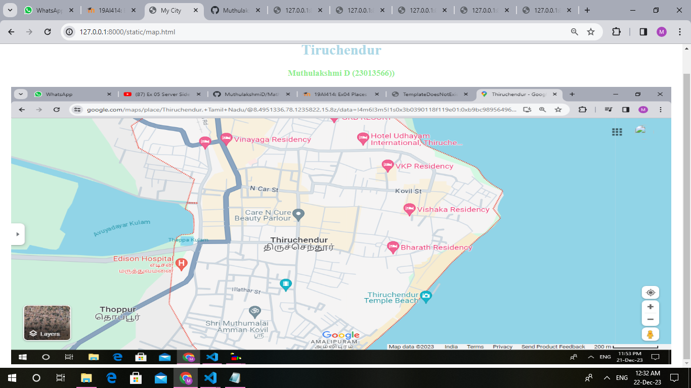
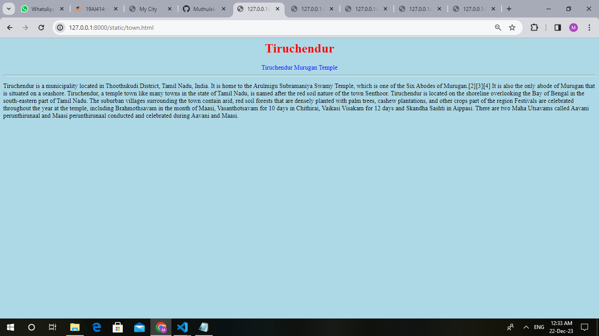
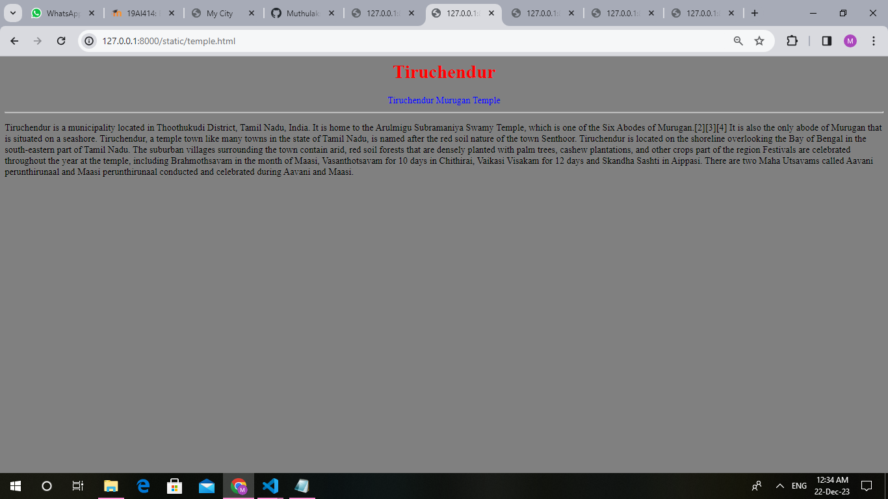
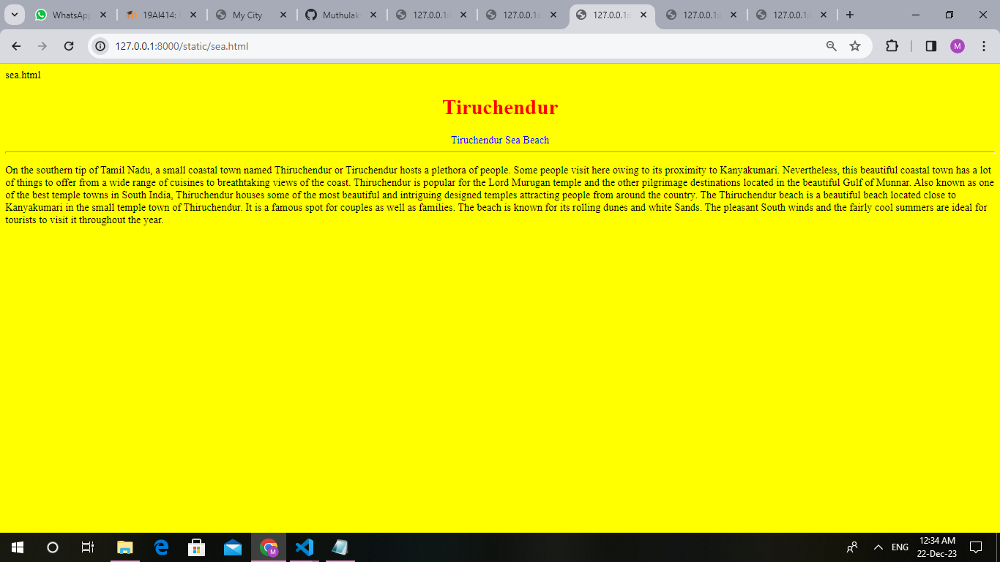
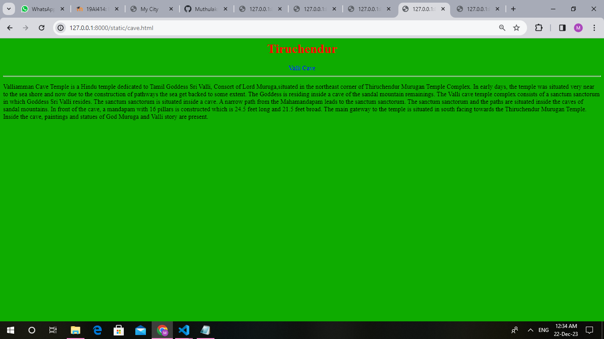
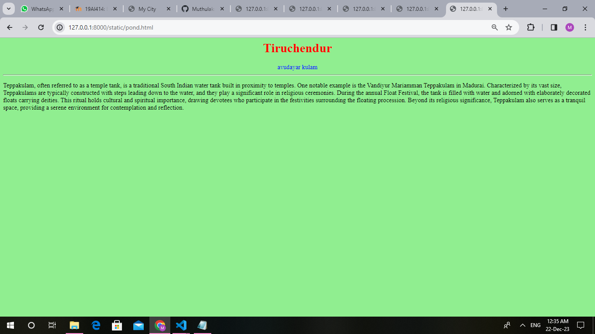

# Ex04 Places Around Me
# date: 30/11/2023
## AIM
To develop a website to display details about the places around my house.

## DESIGN STEPS

### STEP 1
Create a Django admin interface.

### STEP 2
Download your city map from Google.

### STEP 3
Using ```<map>``` tag name the map.

### STEP 4
Create clickable regions in the image using ```<area>``` tag.

### STEP 5
Write HTML programs for all the regions identified.

### STEP 6
Execute the programs and publish them.

## CODE
```
map.html

<html>
<head>
<title>My City</title>
</head>
<body>
<h1 align="center">
<font color="lightblue"><b>Tiruchendur</b></font>
</h1>
<h3 align="center">
<font color="lightgreen"><b>Muthulakshmi D (23013566))</b></font>
</h3>
<center>

<map name="MyCity">
<area shape="rect" coords="700,450,850,500" href="home.html" title="My Home Town">
<area shape="rect" coords="1100,350,1200,400" href="temple.html" title="Tiruchendur Murugan Temple">
<area shape="rect" coords="1150,450,1000,1200" href="sea.html" title="Tiruchendur Sea">
<area shape="rect" coords="200,400,500,450" href="lake.html" title="Avuyadar kulam">
<area shape="rect" coords="1250,250,1300,300" href="cave.html" title="Valli Cave">
</map>
</center>
</body>
</html>

Myhometown.html

<html>
<head>
    <body bgcolor="yellow"></body>
    <h1 align="center">
    <font color="red"><b>Tiruchendur</b></font>
    </h1>
    <font color="blue"<b><center>Tiruchendur Murugan Temple</center></b></font>
    </h3>
    <hr size="3"  bgcolor="red">
    <p>
    <font face="Georgia" size="5"></font>
Tiruchendur is a municipality located in Thoothukudi District, Tamil Nadu, India. It is home to the Arulmigu Subramaniya 
Swamy Temple, which is one of the Six Abodes of Murugan.[2][3][4] It is also the only abode of Murugan that is situated 
on a seashore.
Tiruchendur, a temple town like many towns in the state of Tamil Nadu, is named after the red soil nature of the town 
Senthoor.
Tiruchendur is located on the shoreline overlooking the Bay of Bengal in the south-eastern part of Tamil Nadu. The 
suburban villages surrounding the town contain arid, red soil forests that are densely planted with palm trees, cashew
plantations, and other crops part of the region
Festivals are celebrated throughout the year at the temple, including Brahmothsavam in the month of Maasi, Vasanthotsavam 
for 10 days in Chithirai, Vaikasi Visakam for 12 days and Skandha Sashti in Aippasi. There are two Maha Utsavams called 
Aavani perunthirunaal and Maasi perunthirunaal conducted and celebrated during Aavani and Maasi. 
</font>
</p>
</body>
</html>

temple.html

<html>
<head>
    <body bgcolor="yellow"></body>
    <h1 align="center">
    <font color="red"><b>Tiruchendur</b></font>
    </h1>
    <font color="blue"<b><center>Tiruchendur Murugan Temple</center></b></font>
    </h3>
    <hr size="3"  bgcolor="red">
    <p>
    <font face="Georgia" size="5"></font>
Tiruchendur is a municipality located in Thoothukudi District, Tamil Nadu, India. It is home to the Arulmigu Subramaniya 
Swamy Temple, which is one of the Six Abodes of Murugan.[2][3][4] It is also the only abode of Murugan that is situated 
on a seashore.
Tiruchendur, a temple town like many towns in the state of Tamil Nadu, is named after the red soil nature of the town 
Senthoor.
Tiruchendur is located on the shoreline overlooking the Bay of Bengal in the south-eastern part of Tamil Nadu. The 
suburban villages surrounding the town contain arid, red soil forests that are densely planted with palm trees, cashew
plantations, and other crops part of the region
Festivals are celebrated throughout the year at the temple, including Brahmothsavam in the month of Maasi, Vasanthotsavam 
for 10 days in Chithirai, Vaikasi Visakam for 12 days and Skandha Sashti in Aippasi. There are two Maha Utsavams called 
Aavani perunthirunaal and Maasi perunthirunaal conducted and celebrated during Aavani and Maasi. 
</font>
</p>
</body>
</html>  

pond.html

<html>
<head>
    <body bgcolor="lightgreen"></body>
    <h1 align="center">
    <font color="red"><b>Tiruchendur</b></font>
    </h1>
    <font color="blue"<b><center>avudayar kulam</center></b></font>
    </h3>
    <hr size="3"  bgcolor="blue">
<p>
<font face="Georgia" size="5"></font>
Teppakulam, often referred to as a temple tank, is a traditional South Indian 
water tank built in proximity to temples. One notable example is the Vandiyur
 Mariamman Teppakulam in Madurai. Characterized by its vast size, Teppakulams
  are typically constructed with steps leading down to the water, and they play
   a significant role in religious ceremonies. During the annual Float Festival, 
   the tank is filled with water and adorned with elaborately decorated floats 
   carrying deities. This ritual holds cultural and spiritual importance, drawing 
   devotees who participate in the festivities surrounding the floating procession.
    Beyond its religious significance, Teppakulam also serves
as a tranquil space, providing a serene environment for contemplation and reflection.
</font>
</p>
</body>
</html>


sea.html

<html>
<head>
    <body bgcolor="yellow"></body>
    <h1 align="center">
    <font color="red"><b>Tiruchendur</b></font>
    </h1>
    <font color="blue"<b><center>Tiruchendur Sea Beach</center></b></font>
    </h3>
    <hr size="3"  bgcolor="red">
    <p>
<font face="Georgia" size="5"></font>
On the southern tip of Tamil Nadu, a small coastal town named Thiruchendur or Tiruchendur hosts a plethora of people.
Some people visit here owing to its proximity to Kanyakumari. Nevertheless, this beautiful coastal town has a lot of
things to offer from a wide range of cuisines to breathtaking views of the coast.
Thiruchendur is popular for the Lord Murugan temple and the other pilgrimage destinations located in the beautiful Gulf
of Munnar. Also known as one of the best temple towns in South India, Thiruchendur houses some of the most beautiful and 
intriguing designed temples attracting people from around the country.
The Thiruchendur beach is a beautiful beach located close to Kanyakumari in the small temple town of Thiruchendur. It is
a famous spot for couples as well as families.
The beach is known for its rolling dunes and white Sands. The pleasant South winds and the fairly cool summers are ideal
for tourists to visit it throughout the year. 
</font>
</p>
</body>
</html>

cave.html

<html>
<head>
    <body bgcolor="yellow"></body>
    <h1 align="center">
    <font color="red"><b>Tiruchendur</b></font>
    </h1>
    <font color="blue"<b><center>Valli Cave</center></b></font>
    </h3>
    <hr size="3"  bgcolor="red"><p> 
<font face="Georgia" size="5"></font>
      Valliamman Cave Temple is a Hindu temple dedicated to Tamil Goddess Sri Valli, Consort of Lord Muruga,situated in the
       northeast corner of Thiruchendur Murugan Temple Complex. In early days, the temple was situated very near to the sea
       shore and now due to the construction of pathways the sea get backed to some extent. The Goddess is residing inside
       a cave of the sandal mountain remainings.
       The Valli cave temple complex consists of a sanctum sanctorum in which Goddess Sri Valli resides. The sanctum 
       sanctorum is situated inside a cave. A narrow path from the Mahamandapam leads to the sanctum sanctorum. The 
       sanctum sanctorum and the paths are situated inside the caves of sandal mountains. In front of the cave, 
       a mandapam with 16 pillars is constructed which is 24.5 feet long and 21.5 feet broad. The main gateway to the
       temple is situated in south facing towards the Thiruchendur Murugan Temple. Inside the cave, paintings and statues 
       of God Muruga and Valli story are present.
</font>
</p>
</body>
</html>

```

## OUTPUT














## RESULT
The program for implementing image maps using HTML is executed successfully.
